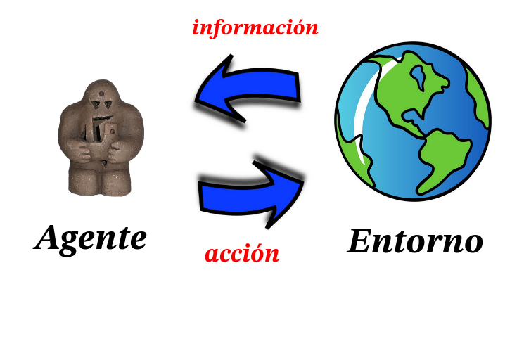

# RL-UBA-2026

> El rabí le explicaba el universo
> "esto es mi pie; esto el tuyo, esto la soga"
> y logró, al cabo de años, que el perverso
> barriera bien o mal la sinagoga.
>
> — Jorge Luis Borges, *El Golem* (1958), en *El otro, el mismo* (1964). [Leer el poema completo](https://www.poemas-del-alma.com/jorge-luis-borges-el-golem.htm).

Repositorio de código y material de clase del curso Introducción al Aprendizaje por Refuerzo, Departamento Ciencias de la Computación, Universidad de Buenos Aires, 2026 // Prof. Matías Bilkis
